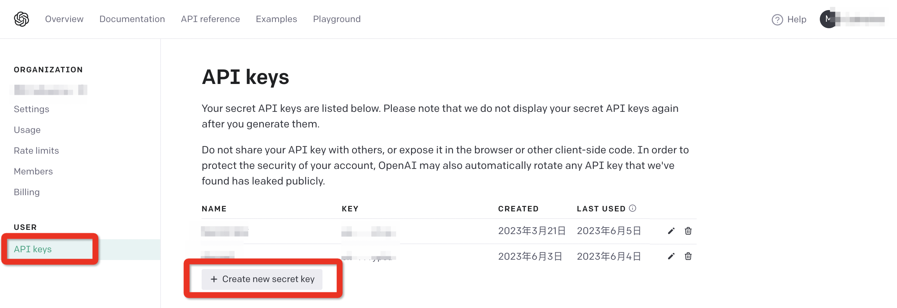
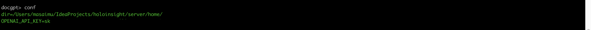
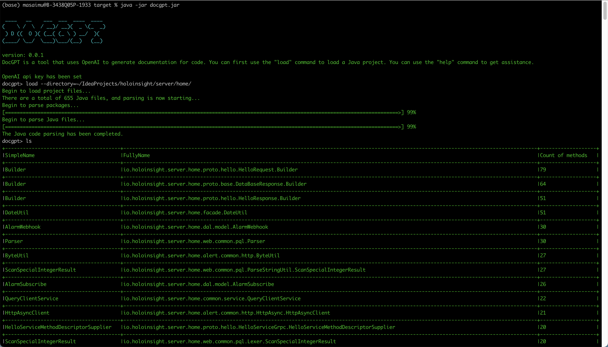
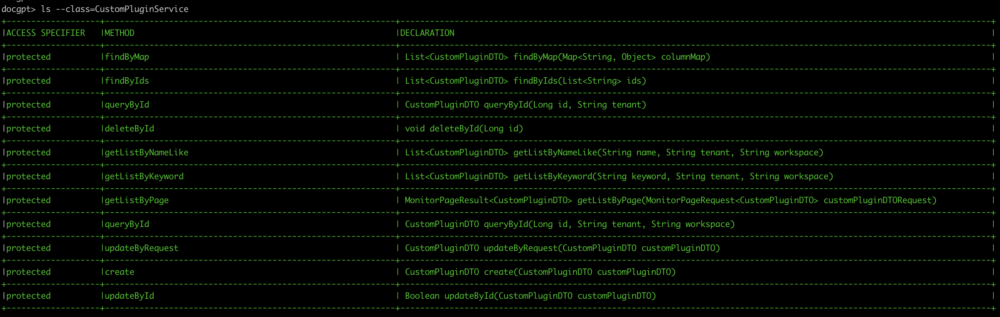
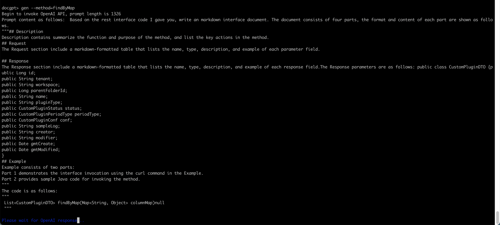
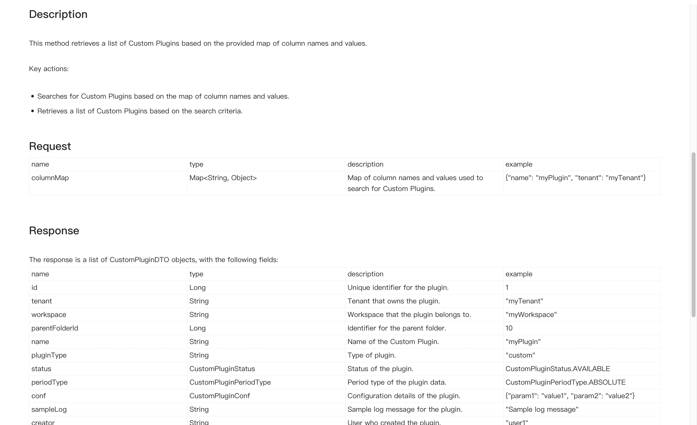
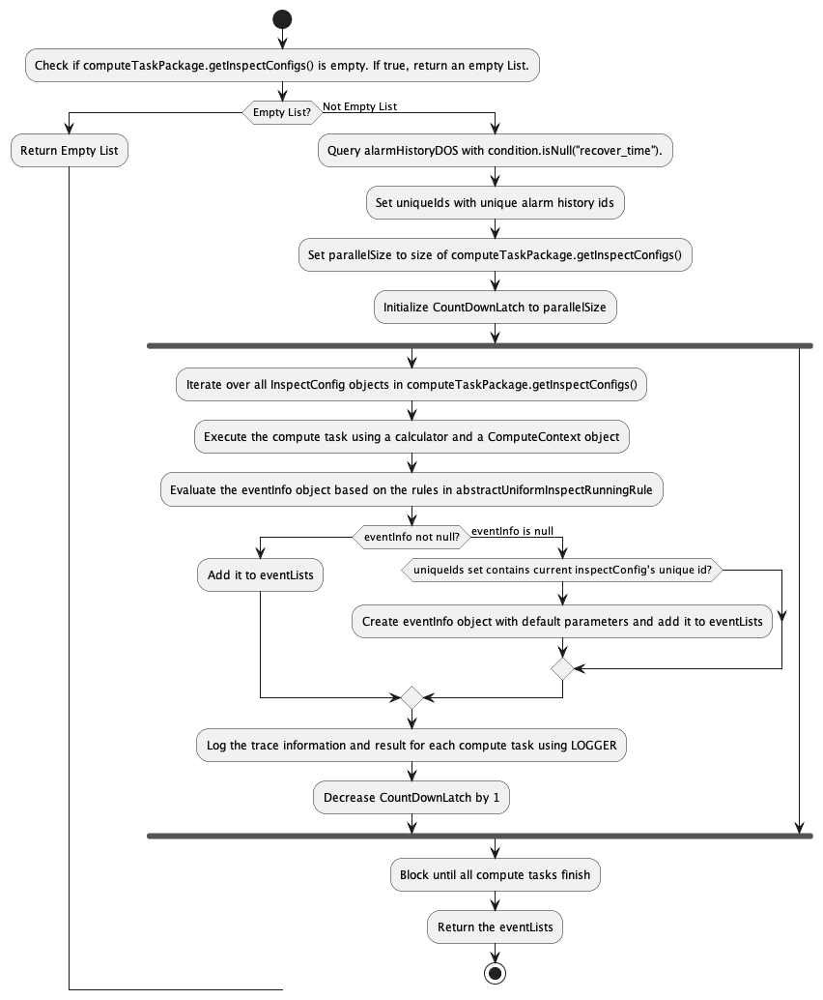
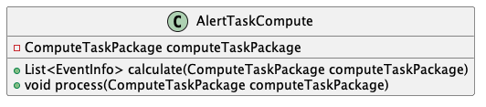

# DocGPT
<a >
    
</a>

A CLI written in Java language that generate API interface document and UML diagrams for you using ChatGPT AI(gpt-3.5-turbo).

简介

## Feature

- Generate API interface documentation, which displays the request and response data structures in tabular form and provides sample code for calling the API in both curl and Java.
- Generate UML activity and class diagrams based on the code.
method activity diagram and class diagram.
- Provide a command-line tool with autocomplete feature.
- No need for a web proxy even in mainland China.

## Installation

Download`docgpt.jar`，start with `java` command:
```plain
java -jar docgpt.jar
```
## Setup
### OpenAI
Please first create your OpenAI API Key. The [OpenAI Platform](https://platform.openai.com/account/api-keys) allows you to generate a new API Key.



### config
When using DocGPT, there are two ways to configure the OpenAI API Key. 
- One is to set the environment variable using the command below
```plain
export OPENAI_API_KEY=sk-xxxxxxx
```
- The other is to set the OPENAI_API_KEY configuration using the conf command of DocGPT
```plain
docgpt> conf --token=sk-***
```

## Usage
### Load project
In order to assemble prompt content more effectively and save token consumption, DocGPT uses the load command to load and parse Java code.
```plain
docgpt> load --directory=<Java file directory>
```


Tips:
1. If you have already specified the directory parameter, you can use the `load` command to quickly load it without specifying the directory parameter again later. You can use `conf` to check the default directory.

2. The `--directory` path support auto-completion, and you can use the tab key to select the path.
### List
The `ls` command list all loaded classes and the number of methods they contain.

You can add `--method=<Class Name>` to list the methods that the class contains.

### Generate API interface documentation
By using `gen` and specifying the method name with `--method=`, you can generate API documentation in Markdown format.



### Generate UML diagram
By using `gen --uml --method=<Method name>`, you can generate the activity diagram of the method, and `gen --uml --class=<Class name>` generate the class diagram of the class.
<center>
    
    <br>
    <div style="color:orange; border-bottom: 1px solid #d9d9d9;
    display: inline-block;
    color: #999;
    padding: 2px;">Method activity diagram</div>
</center>
<center>
    
    <br>
    <div style="color:orange; border-bottom: 1px solid #d9d9d9;
    display: inline-block;
    color: #999;
    padding: 2px;">Class diagram</div>
</center>

Reference
- [javaparser](https://github.com/javaparser/javaparser)
- [jline](https://github.com/jline/jline3)
- [OpenAI Chat completions documentation](https://platform.openai.com/docs/guides/chat).
